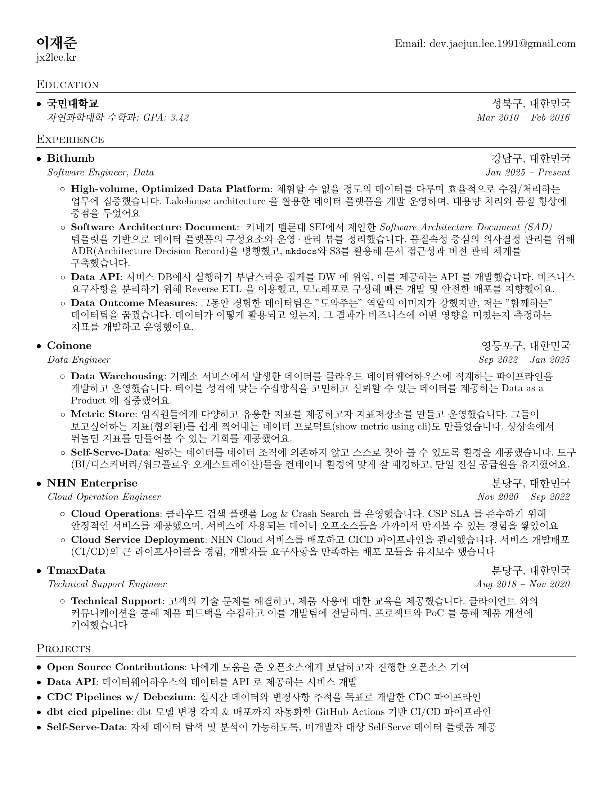

fork https://github.com/sb2nov/resume

**Preview:**



### Quick start

Get started quickly using [Overleaf](https://www.overleaf.com/latex/templates/software-engineer-resume/gqxmqsvsbdjf) template.

### Build using Docker

```sh
docker build -t latex .
docker run --rm -i -v "$PWD":/data latex pdflatex jaejun_lee_resume.tex
```

### Docker w/ vscode Latex Workshop

```sh
docker pull --platform linux/amd64 ghcr.io/xu-cheng/texlive-full:latest
```

### Work with vscode
1. Install VS Code, Docker Desktop, and the “LaTeX Workshop” extension.
2. Pull the TeX Live image ghcr.io/xu-cheng/texlive-full (Apple Silicon may need the platform flag):
```bash
docker pull --platform linux/amd64 ghcr.io/xu-cheng/texlive-full:latest
```

3. This repo’s .vscode/settings.json enables Docker mode and selects the image:
```json
{
    "latex-workshop.docker.enabled": true,
    "latex-workshop.docker.image.latex": "ghcr.io/xu-cheng/texlive-full"
}
```

4. Open the folder in VS Code and run “LaTeX Workshop: Build LaTeX project” to generate jaejun_lee_resume.pdf.


### License

Format is MIT but all the data is owned by Sourabh Bajaj.
