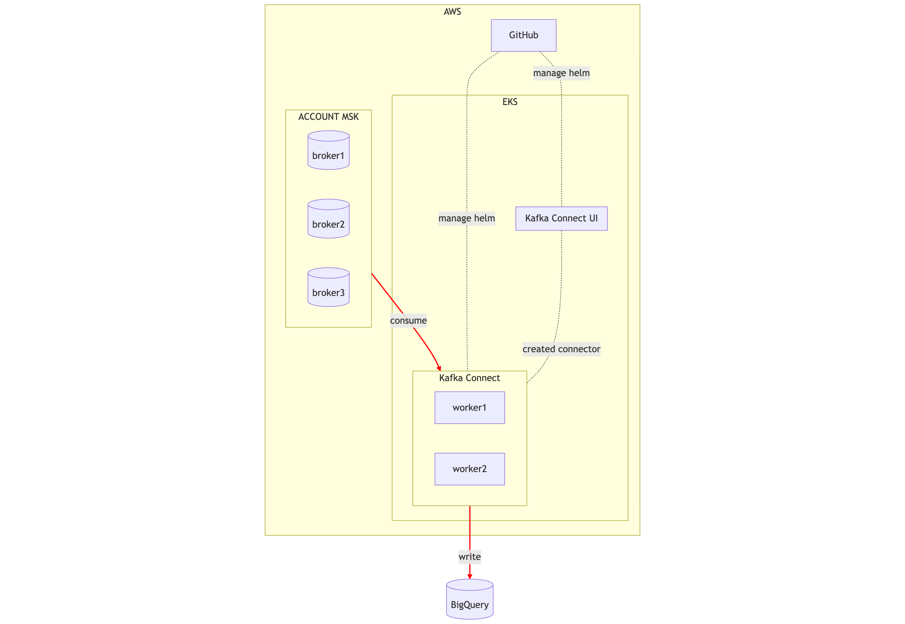
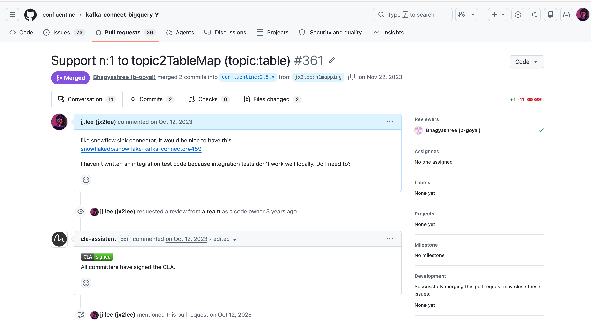
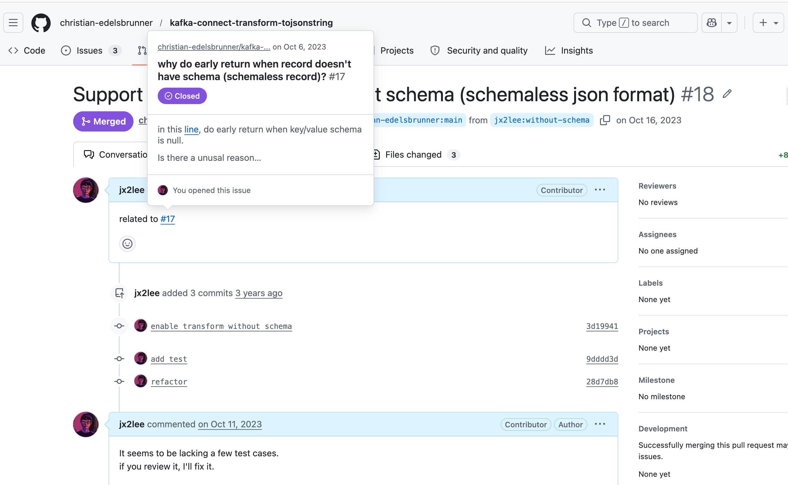
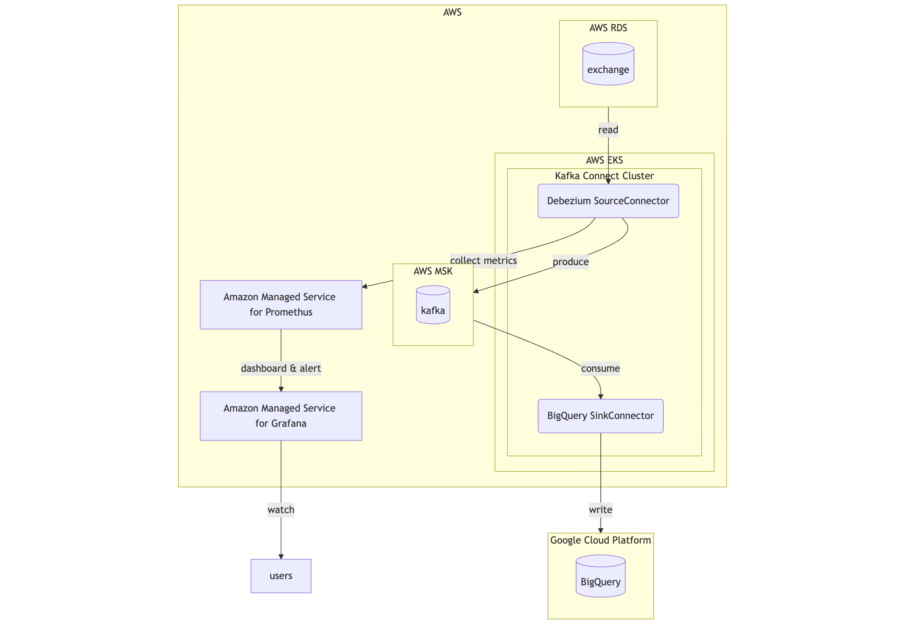
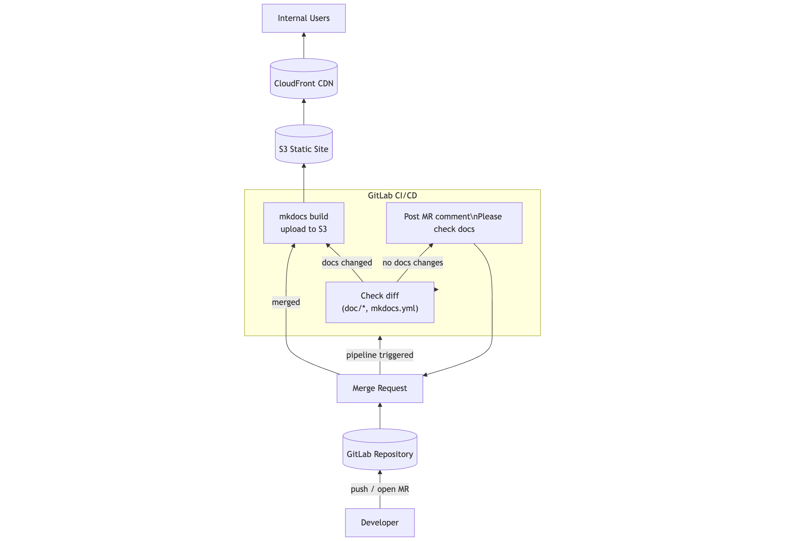
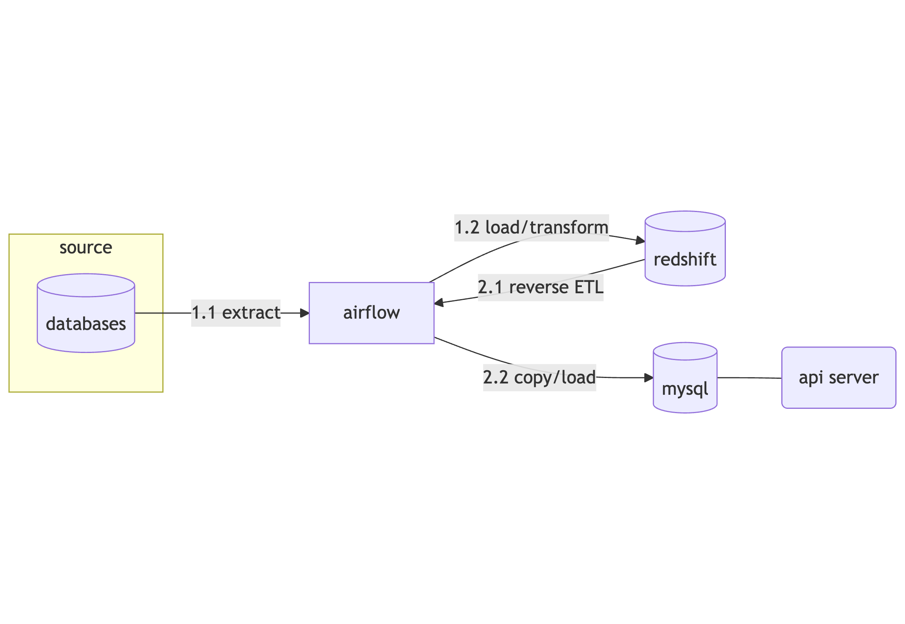

# 돌아가는 데이터 플랫폼보다 버티는 데이터 플랫폼을 지향합니다

이재준  
[jx2lee.kr](https://www.jx2lee.kr)  

---

# 한 장 요약

- 2018년부터 데이터/클라우드 플랫폼을 구축·운영해 온 엔지니어
- 클라우드뿐 아니라 IDC·온프렘 환경에서의 운영 경험(TmaxData/NHN Enterprise)
- 가상자산 거래소와 클라우드 서비스 환경에서 **배치·스트리밍 파이프라인**
- `Kafka / Kafka Connect / Debezium / Airflow / Kubernetes / AWS·GCP`
- `버티는 구조`, `복구 가능성`, `설명 가능한 운영`

---

# 공고와 제 경험의 매핑

| 공고 핵심 | 제 경험 |
| --- | --- |
| 전사 Kafka 클러스터 운영 | `AWS MSK(Managed Kafka) + Kafka Connect` 기반 스트리밍 적재 파이프라인 |
| CDC 기반 ETL 운영 | `Debezium Source Connector + Sink Connector(BigQuery/JDBC)` 운영 |
| 워크플로우 오케스트레이션 | `Airflow` 기반 배치 파이프라인 운영, SLA 기준 파이프라인 설계 및 장애 대응 |
| Kubernetes 기반 데이터 파이프라인 | `EKS + Helm + ArgoCD` GitOps 운영 |

기능을 하나 더 붙이는 것보다 장애(Incident)와 변경 속에서도 오래 버티는 구조를 만드는 일

---

# Project Introduction

---

# 1. Kafka Connect 기반 스트리밍 파이프라인 표준화

<!--  -->

---

# 1. Kafka Connect 기반 스트리밍 파이프라인 표준화

**Description**

- 기존 `Kinesis + Lambda` 기반 스트리밍 적재 파이프라인
- 거래소 회원 서비스의 EDA(Event Driven Architecture) 전환. 회원 이벤트(kafka)를 안정적으로 수집·적재하기 위한 표준화된 스트리밍 파이프라인 요구
- Connect 클러스터(Helm Chart/ArgoCD) 기반으로 배포운영ㅡ확장성

**Problem**

- Kinesis 기반 파이프라인의 to be deprecated. 이벤트를 소비하는 흐름의 일원화
- 스케일링과 오류 재처리에서의 높은 운영 복잡도

**Action**

- Kafka Connect(Distributed Mode) 전환. Sink Connector(BigQuery)
- `EKS + Helm + ArgoCD` 기반으로 Connect 클러스터(cp-helm-charts) 배포 및 관리
- end-to-end Metric(promethus) & Grafana Alert 기반 Observability

---

# 1. Kafka Connect 기반 스트리밍 파이프라인 표준화

**Impact**

- 스트리밍 수집 파이프라인을 표준화. 다양한 소스/타깃 시스템으로 확장 가능한 데이터  인터페이스 제공
- 파이프라인의 유지보수 비용 절감
- 로그·이벤트 수집의 신뢰성 확보. 이후 CDC 및 확장 가능한 기반 마련

**Self-Reflection**

- Kafka Connect는 메트릭, 재처리, 버전 호환성, 스키마 일관성까지 포함한 운영 도구임을 체감
- DLQ 전략, 재시도 정책, Connector 재배포 타이밍 같은 실전 운영 포인트를 직접 경험하며 스트리밍 파이프라인 운영 감각
- `EKS / Helm / ArgoCD` 기반 환경을 경험하며 플랫폼 엔지니어로서의 운영 역량 확보 (container friendly)

---

# 1. Kafka Connect 기반 스트리밍 파이프라인 표준화

https://github.com/confluentinc/kafka-connect-bigquery/pull/361

https://github.com/christian-edelsbrunner/kafka-connect-transform-tojsonstring/pull/18

---

# 2. Debezium 기반 CDC 파이프라인 구축

<!--  -->

---

# 2. Debezium 기반 CDC 파이프라인 구축

**Description**

- RDMS 의 변경사항을 확보하기 위해 Debezium 기반 CDC 파이프라인 구축
- Debezium Source Connector가 RDS binlog를 읽어 MSK로 발행하고, Kafka Connect Sink Connector가 BigQuery로 적재

**Problem**

- 변경 이력 데이터 확보의 어려움 (삭제/갱신 이벤트를 포함한 Changed history)

**Action**

- DBA와 협업해 서비스 영향이 없도록 debezium 운영
- `Prometheus -> Grafana` 기반으로 이벤트 발생부터 적재까지의 지표 관측 가능한 환경 구성

---

# 2. Debezium 기반 CDC 파이프라인 구축

**Impact**

- 기존 log 기반 파이프라인에서 얻기 어려웠던 행 단위 변경 기록을 안정적으로 수집
- `Kafka Connect -> BigQuery` 흐름이 정착. 재사용 가능한 CDC 플랫폼 표준화

**Self-Reflection**

- CDC는 영 난이도가 높은 분산 시스템임을 깊이 체감
- retention, offset, snapshot, lock 같은 실전 포인트를 직접 겪고 해결하며 운영 역량 강화
- Kafka Connect와 Debezium을 문서 수준이 아니라 장애, 성능, 설정 문제까지 deep dive
- 관측성, 복구성, 운영 관점의 시각

---

# 3. 데이터 플랫폼 아키텍처의 재설계

---

# 3. 데이터 플랫폼 아키텍처의 재설계

**Description**

- 데이터 플랫폼 전반의 복잡도가 증가하면서 시스템 구조, 운영 방식, 의사결정 이유를 명확히 설명하기 어려운 상황
- CMU SEI의 SAD 템플릿을 기반으로 플랫폼 전체 아키텍처를 재설계. ADR을 도입해 기술 선택과 운영 기준 문서화
- Markdown. `mkdocs + GitLab CI/CD + S3 static hosting`으로 제공

**Problem**

- 방대한 구성요소에 비해 문서가 산발적으로 흩어져 있어 신규 온보딩어 어려움
- "왜 Redshift 인가?", "운영정책 기준은?" 같은 의사결정이 쌓이지 않아 반복적인 논의 발생
- 운영 관리 문서 부족으로 조직 간 용어 불일치

**Action**

- SEI SAD 템플릿 기반으로 아키텍처를 재설계하고 데이터 플랫폼 특성에 맞는 커스텀 뷰 구성(e.g Pipeline view)
- ADR을 도입해 변경 이력 & 의사결정 이유 자산화
- `mkdocs` 기반 문서 빌드 파이프라인. 코드 변경 대비 문서 미변경 시 코멘트를 다는  가드레일 개발

---

# 3. 데이터 플랫폼 아키텍처의 재설계

**Impact**

- 설계 철학, 운영, 품질 속성을 함께 보는 시야의 확장
- 팀 간 책임 경계의 명확한 분리 / 운영 혼선과 중복 제거
- 감이 아니라 ADR 기반으로 의사결정을 쌓는 문화 주도

**Self-Reflection**

- 기술 문서화는 단순 기록이 아니라 조직의 사고 모델을 통합하는 작업임을 학습
- 코드, 운영, 의사결정의 관계를 구조적으로 관리하지 않으면 혼란이 기하급수적으로 커진다는 점
- 플랫폼 문서는 일관성을 유지하기 위한 수단이고, 더 깊은 운영 영역으로 연결 필요성

---

# 제가 운영에서 중요하게 보는 기준

1. **관측 가능해야 운영할 수 있습니다**: 메트릭, 로그, 알람 없이 안정성은 우연에 가깝습니다.
2. **복구 가능해야 플랫폼입니다**: 재시작, 재처리, 오프셋 복원, 장애 대응 문서까지 설계해야 합니다.
3. **설명 가능해야 확장할 수 있습니다**: SAD, ADR, Runbook이 있어야 팀이 커져도 일관성이 유지됩니다.
4. **데이터는 제품이어야 합니다**: 쌓아두기만 하지 않고 누가 어떻게 신뢰하고 쓰는지가 더 중요합니다.

제가 생각하는 "버티는 플랫폼"은  
운영자가 감으로 지키는 시스템이 아니라, 누가 맡아도 복구와 설명이 가능한 시스템입니다.

---

# 제가 카카오모빌리티에서 무엇을 할 수 있을까요

- `Kafka / CDC` 운영 노하우 축적: Connector 운영 기준, 메트릭, 알람, 복구 절차 정교화
- `플랫폼 안정성 강화`: 스트리밍 흐름의 병목과 누락을 빠르게 감지할 수 있는 관측 체계 강화
- `Kubernetes 기반 데이터 인프라 운영`: 배포 자동화와 GitOps 방식으로 운영 일관성 확보
- `설명 가능한 플랫폼`: 설계는 trade-off 의 연속. 문서와 운영 기준을 함께 남겨 조직 전체 생산성 향상

카카오모빌리티 데이터플랫폼팀이 맡고 있는  
`사업·기술·준법 전 영역을 지탱하는 플랫폼`이라는 문제를  
운영자 관점에서 함께 풀고 싶습니다.

---

# 마무리

- 배치는 물론 `스트리밍 파이프라인`을 만들 수 있고, 그보다 더 중요하게는 `버티는 데이터 플랫폼`을 운영해 온 경험이 있습니다.
- `Kafka Connect`, `Debezium`, `Kubernetes`, `Cloud` 기반 운영 경험을 바탕으로 카카오모빌리티의 데이터 플랫폼 안정성에 기여할 수 있습니다.
- 오늘은 "무엇을 만들었는가"보다 `어떻게 장애와 변경 속에서도 버티게 만들었는가`를 중심으로 말씀드렸습니다.

감사합니다.

---

# Appendix. Data API: 데이터 서빙까지 데이터의 end to end 경험

---

